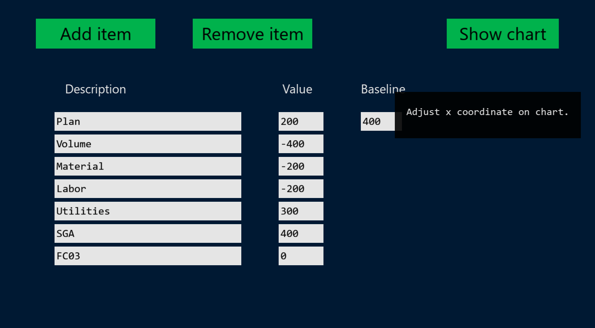
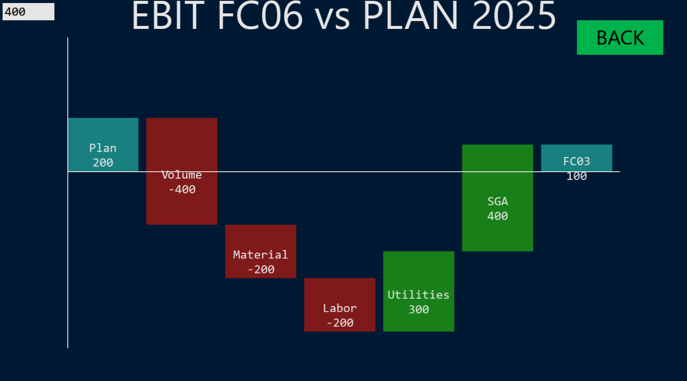

# freetype-subpixel (fs) user interface
Welcome to freetype-subpixel (fs), a simple immediate mode UI written in C using OpenGL. While there are many other UI libraries available, they are too complex to my needs.
Goals and features:
 - Single-header file library
 - Quality font rendering with FreeType subpixel option
 - Five UI elements: text, button, input box, rectangle, and display on hover

## Dependecies:
 - [freetype](https://freetype.org/) library compiled with subpixel rendering
 - [glfw](https://www.glfw.org/)
 - [glad](https://glad.dav1d.de/)

## How to use
See chart.c

## Credit
 - [vassvik's text drawing tutorial](https://github.com/vassvik/text_drawing_tutorial)

# TODO
 - Testing
